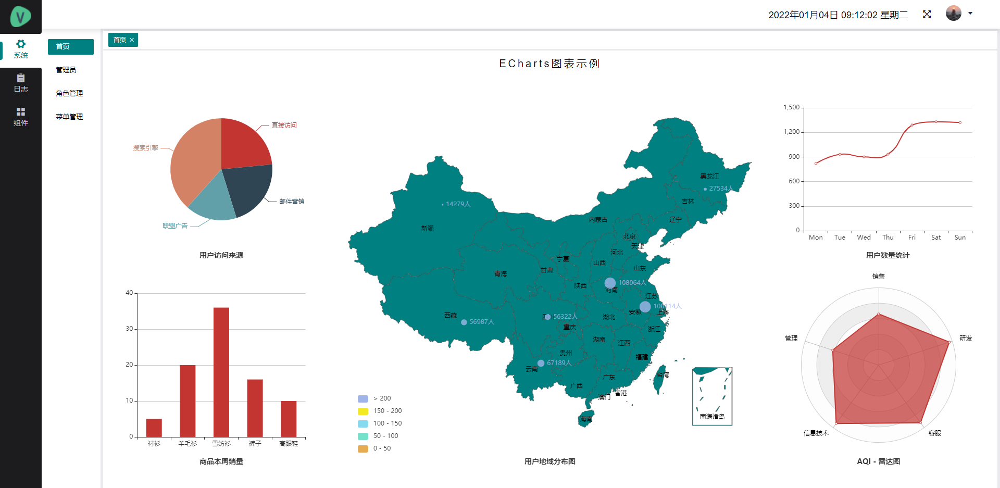
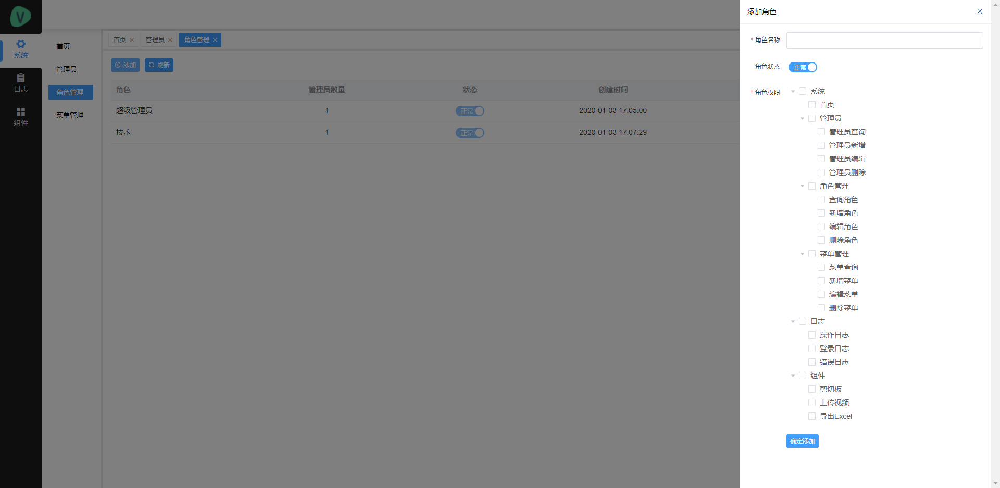
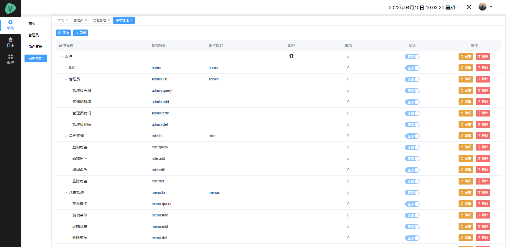
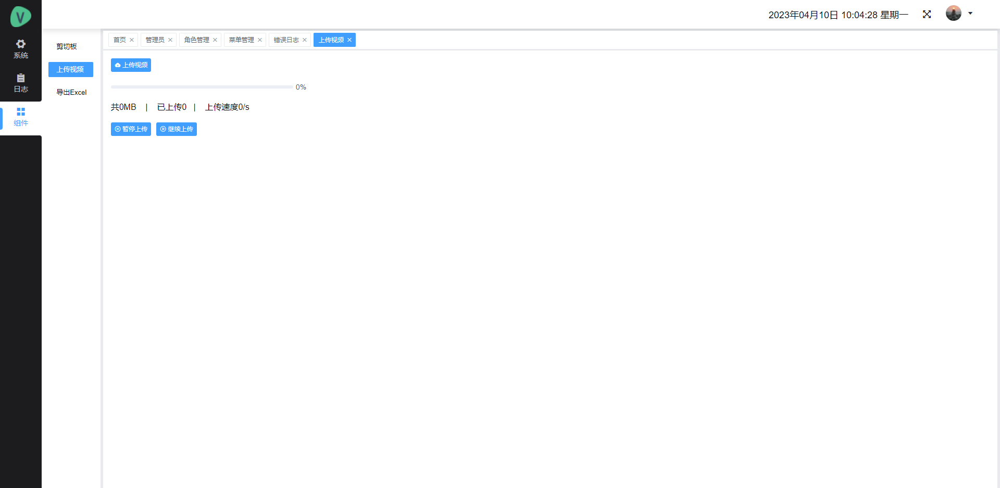

# spba-vue
该项目基于Vue，使用vue-cli3脚手架，引用Element UI组件库、Echarts等，作为一套基础的后台系统，适用于绝大部分的后台管理系统开发。包含：登录、注销、可视化数据大屏、管理员、角色管理、菜单管理、权限管理、操作日志、登录日志、错误日志、七牛云上传等功能；需要配合后端接口一起使用。


## 项目截图









## 安装步骤
```
下载代码

git clone https://github.com/wdjisn/SpringBoot-Vue.git
```

```
进入代码目录                                               
```

```
安装项目依赖，等待安装完成之后，安装失败可用 cnpm 或 yarn

npm install                                                     
```

```
运行，浏览器访问 http://localhost:8080

npm run serve                                                   
```

```
执行构建命令，生成的dist文件夹

npm run build                                                   
```


## 后端代码仓库
```
https://github.com/wdjisn/SpringBoot-Admin.git
```

## 疑问解答
```
微信：wdjisn
```